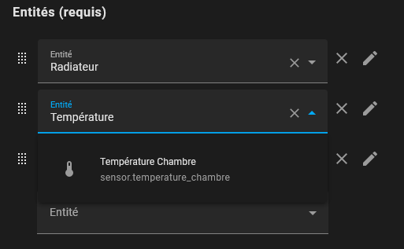
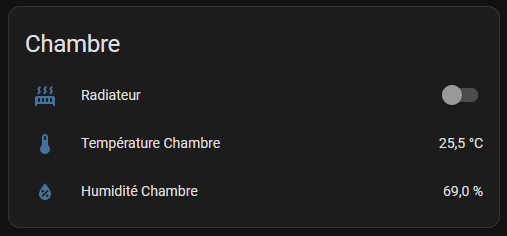
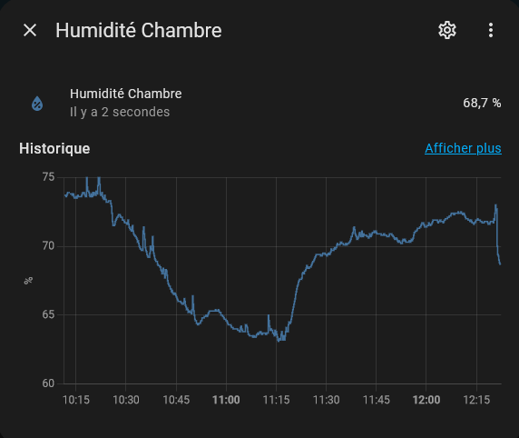

# wemos-d1-mqtt-sensor
Wemos D1 Mini sensor controller with MQTT events publisher

## Description

The code of this project allows to configure a wemos d1 mini equipped with a temperature and humidity sensor DTH22 in Home Assistant via MQTT.

## Configuration

Fill the configuration variable sections with your informations.

```cpp
// Configuration
// Sensor
uint8_t pin = D2;
unsigned long interval = 30000;

// Wifi connection
const char* ssid = "Wifi SSID";
const char* password = "Wifi password";

// MQTT
const char* mqtt_server = "127.0.0.1"; // Update the IP with your MQTT server
// uncomment following lines if your server is authenticated
// const char* mqtt_user = "user";
// const char* mqtt_password = "pass";

// MQTT Sensors
String sensor_location = "location";
String sensor_uid = "wemos_" + sensor_location;
String topic = "sensor/temperature/" + sensor_location;

// Home assistant discovery
String temperature_discovery_topic = "homeassistant/sensor/home_sensor_" + sensor_location + "/temperature/config";
String temperature_readable_name = "YOURSENSORNAME " + sensor_location;
String humidity_discovery_topic = "homeassistant/sensor/home_sensor_" + sensor_location + "/humidity/config";
String humidity_readable_name = "YOURSENSORNAME " + sensor_location;
```

If the wifi and MQTT configuration is correct, temperature and humidity sensors should appear in home assistant.

## Screenshots








## Resources

- https://github.com/MarkJB/wemos-d1-mini-esp8266-mqtt-sht30-temp-sensor
- https://roelofjanelsinga.com/articles/mqtt-discovery-with-an-arduino/
